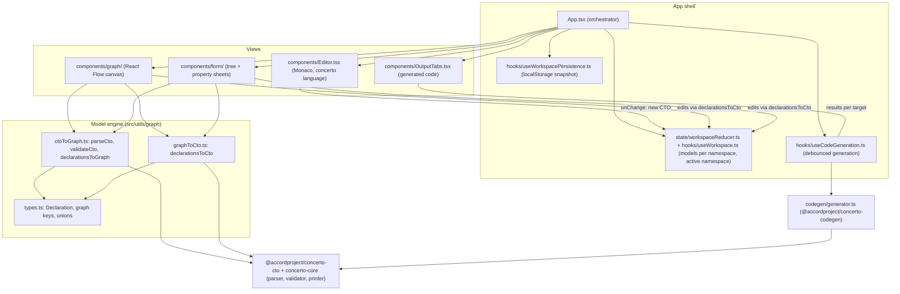
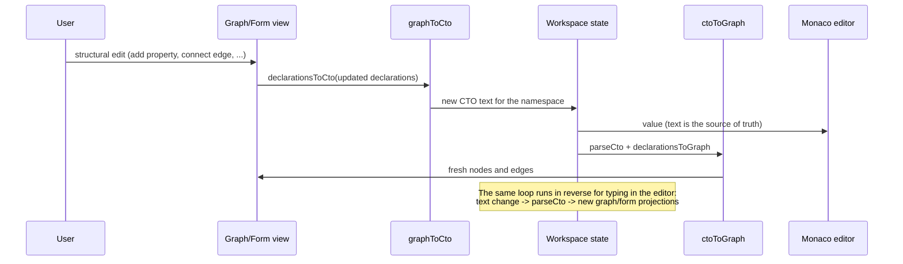

# Concerto Playground architecture

This document is the map for a new developer: which modules exist, how they relate, and how data flows between the CTO text, the visual graph and the generated code. The reasoning behind the technology choices is in [docs/adr/](adr/).

## The one rule that explains everything

**The CTO source text is the single source of truth.** Every view is a projection of it:

- the Monaco editor shows it directly,
- the graph view parses it into nodes and edges,
- the form view parses it into a tree and property sheets,
- the output tabs generate code from it.

Every edit, no matter which view it happens in, becomes new CTO text and flows back through the same central state. There is no second model store that can drift out of sync.

## Module diagram

## The parsing engine and the serializer: ctoToGraph and graphToCto

The pair of modules in `src/utils/graph/` implements the round trip between text and structure.

### ctoToGraph.ts (text to structure)

- `parseCto(cto)` runs the official Concerto parser (`@accordproject/concerto-cto`) and maps the AST into the playground's own `ConcertoModel`: a namespace, its imports, and a flat list of `Declaration` objects (`src/utils/graph/types.ts`). This intermediate shape is deliberately simpler than the metamodel AST; every view works against it.
- `validateCto(cto, peers)` loads the model plus its open peer namespaces into a Concerto `ModelManager`, so semantic errors (unresolved types, bad inheritance) surface with the official messages. Parse errors are refined to line/column via `describeParseError`.
- `declarationsToGraph(declarations, context)` turns `Declaration[]` into React Flow nodes and edges:
  - node kind per declaration type via the typed `NODE_KIND_BY_DECLARATION` lookup;
  - a custom columnar layout places declarations by inheritance depth (children right of their parents), with node heights estimated from their row counts;
  - property/relationship edges hang off per-property source handles, inheritance edges connect bottom-to-top handles;
  - types imported from other namespaces become distinct "imported" nodes in their own column, resolved against the open workspace (`buildExternalTypeMap`), unresolved ones flagged.

### graphToCto.ts (structure to text)

- `declarationsToCto(model)` serializes a `ConcertoModel` back into CTO source. Any structural edit made in the graph or the form (add property, rename, connect an edge, delete a declaration) mutates the parsed `Declaration[]` and immediately re-serializes it to text.

### The round trip

Because both directions go through the same `Declaration[]` shape and the official Concerto parser/printer, a change is either representable and round-trips cleanly, or it is rejected with a real Concerto error (the form view refuses to save CTO that no longer parses).

## Supporting flows

- **Multi-namespace workspace**: models are keyed by namespace in the workspace reducer; editing a model whose namespace declaration changed migrates its key, and cross-namespace type references resolve against the other open models (clickable navigation, foreign-namespace nodes).
- **Code generation**: `useCodeGeneration` debounces edits, then `codegen/generator.ts` feeds all open sources to `@accordproject/concerto-codegen` for each target language, visible tab first. Failed generation falls back to a static preview with the error attached.
- **Persistence and sharing**: see [ADR 0004](adr/0004-localstorage-and-url-hash-persistence.md); the URL hash (shared link) takes precedence over the localStorage snapshot on startup.
- **Error containment**: each view is wrapped in an `ErrorBoundary` so a rendering crash in one panel never takes down the app or loses the schema text.
